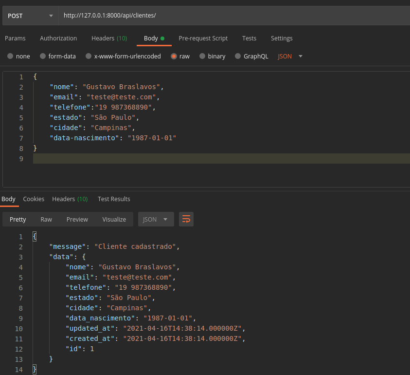
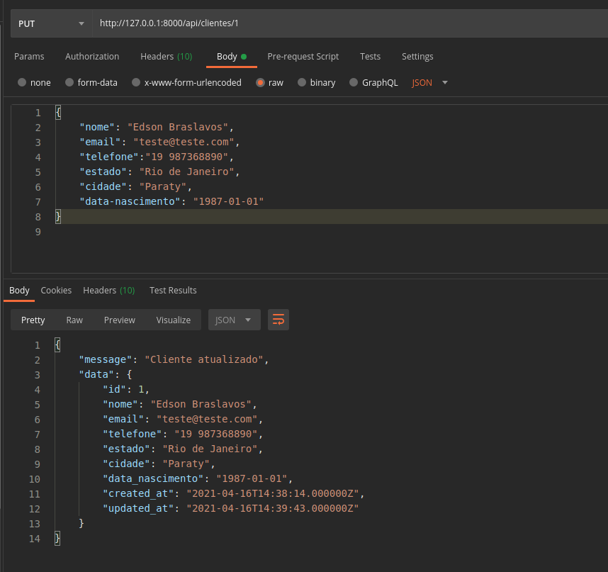
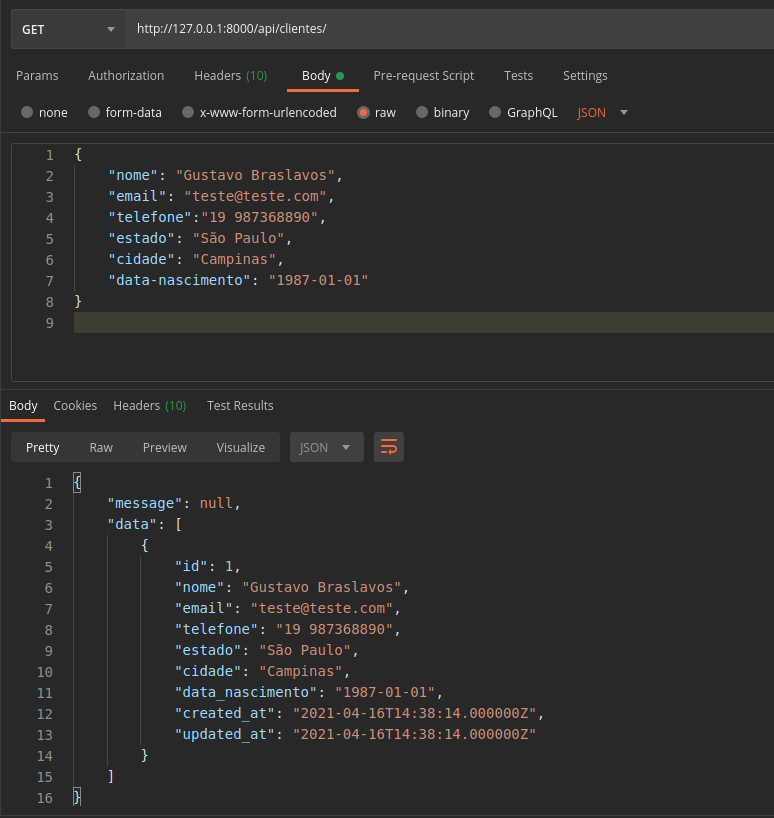
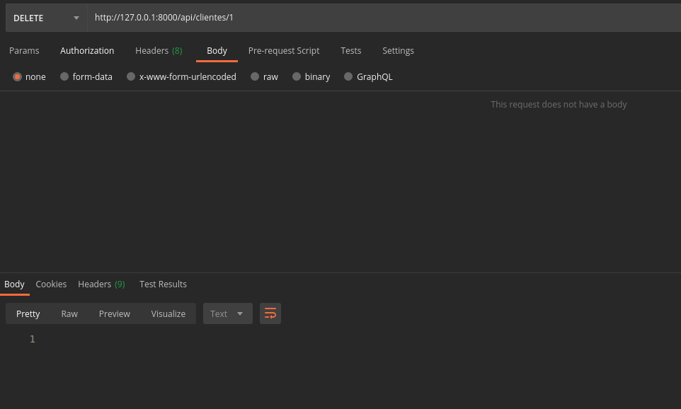

# API Cadastro Clientes
## Introdução:
Uma **API RESTful** desenvolvida com **Laravel 8** para gerenciamento de cadastros de clientes.

## Requirementos:
- PHP;
- MySQL;
- Composer.

## Executando o projeto:
1. Executar `php composer.phar install` e aguardar a instalação de todas as dependências;
2. Iniciar o Laravel através do comando `php artisan serve`;
3. Acessar o MySQL e executar o script `useful/criarBancoClientes.sql`;
4. Configurar o arquivo `/.env` na raiz do projeto com acessos ao banco de dados:
```
DB_CONNECTION=mysql
DB_HOST=127.0.0.1
DB_PORT=3310
DB_DATABASE=clientes
DB_USERNAME=root
DB_PASSWORD=root
```
5. Rodar as migrations do Laravel através do comando `php artisan migrate`.

## Exemplo de uso:
### Cadastro de cliente:


### Alterando cliente:


### Listando cliente:


### Deletando cliente:

